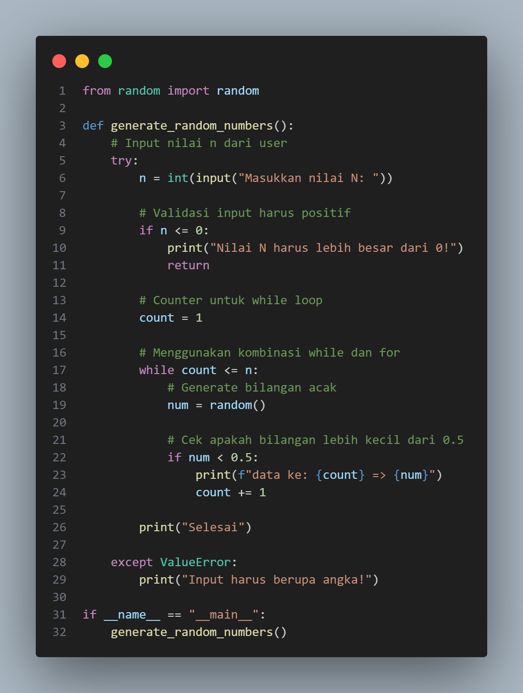
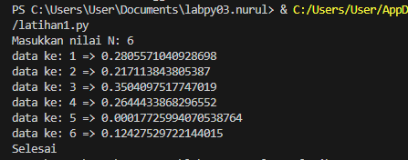
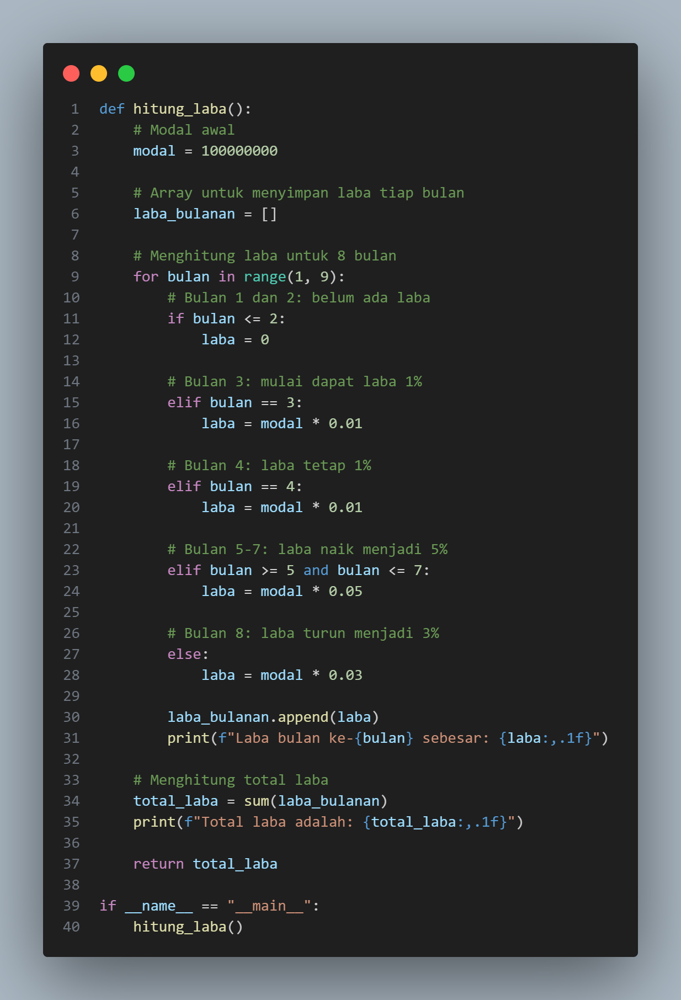
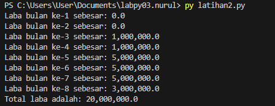
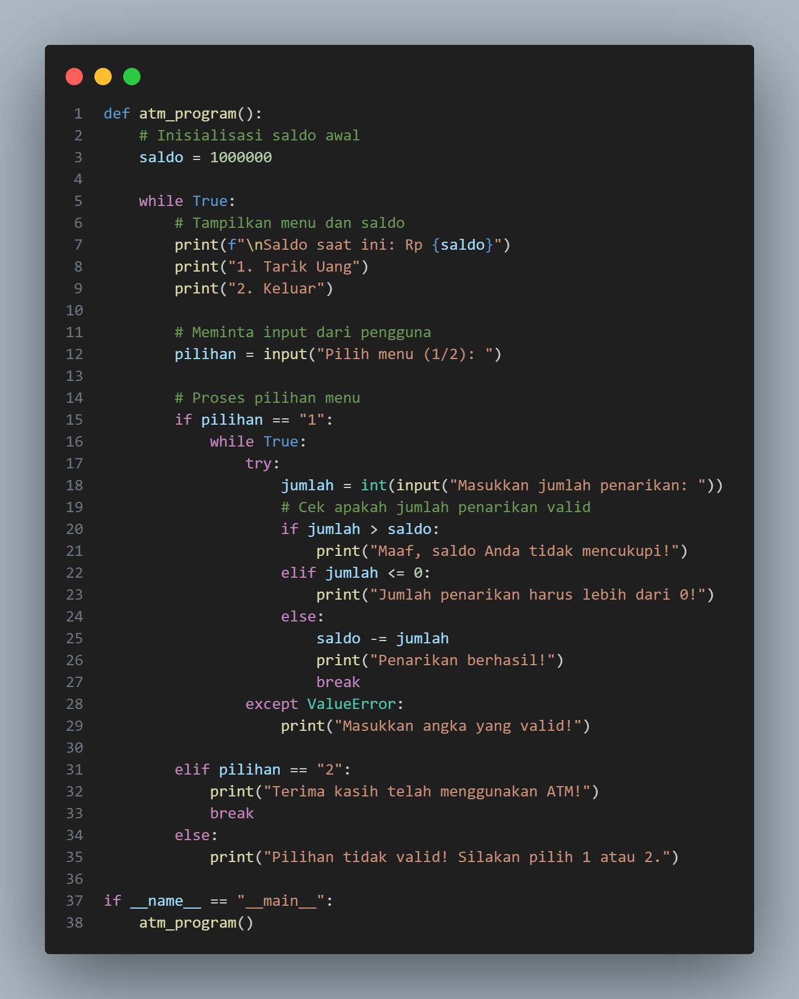
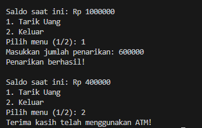

# labpy-03
# Data Diri

Nama : Zizantara Arzeva Cakra Kahana 

NIM : 312410398

Kelas : TI,24.A.3

# Latihan 1

## Input Code

## Output

## Program di atas memiliki fitur-fitur berikut:

1. Import fungsi random() dari modul random
2. Input nilai n dari user saat runtime
3. Validasi input:
    * Memastikan input adalah angka
    * Memastikan input lebih besar dari 0
4. Kombinasi while dan for:
    * While untuk mengontrol jumlah iterasi
    * Kondisional untuk memeriksa bilangan < 0.5
5. Menampilkan bilangan acak dengan format yang sesuai

## Beberapa poin penting dalam program:

1. Program akan terus mencoba generate bilangan acak sampai mendapatkan bilangan < 0.5
2. Setiap bilangan yang memenuhi syarat akan ditampilkan dengan format "data ke: x => y"
3. Program akan berhenti setelah mendapatkan n bilangan yang memenuhi syarat

# Latihan 2

## Input Code

## Output 

## Program di atas memiliki fitur-fitur berikut:

1. Inisialisasi modal awal 100 juta
2. Perhitungan laba berdasarkan kondisi:

* Bulan 1-2: 0% (belum ada laba)
* Bulan 3-4: 1%
* Bulan 5-7: 5%
* Bulan 8: 3%

3. Menampilkan laba per bulan
4. Menghitung dan menampilkan total laba

# Latihan 3

## Input Code

## Output 

## Program di atas memiliki fitur-fitur berikut:

1. Menampilkan saldo awal Rp 1.000.000
2. Menu untuk:

* Tarik uang
* Keluar dari program

3. Validasi input untuk:

* Memastikan jumlah penarikan adalah angka valid
* Memeriksa kecukupan saldo
* Memastikan jumlah penarikan lebih dari 0

4. Pesan konfirmasi untuk setiap operasi